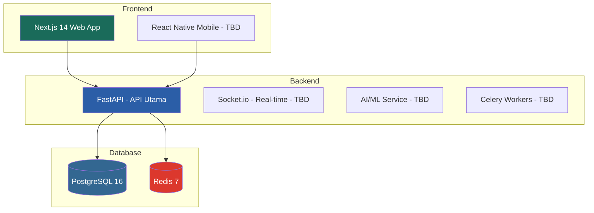

# 🛡️ JagaDiri — Platform Kesehatan Digital Indonesia

> **"Selalu Ada yang Jaga"** — Jaring pengaman kesehatan digital untuk mereka yang hidup sendiri.


## 📋 Tentang JagaDiri

JagaDiri adalah platform kesehatan digital yang dirancang khusus untuk individu yang hidup sendiri (*solo living*) di Indonesia. Platform ini berfungsi sebagai **jaring pengaman kesehatan digital** yang melindungi pengguna secara proaktif — bahkan sebelum mereka meminta bantuan.

### Target Pengguna
- 🏠 Pekerja muda urban yang tinggal sendiri
- 👴 Lansia yang tinggal mandiri
- 🎓 Mahasiswa perantau
- 💼 Profesional dengan kondisi kronis
- 🤰 Perempuan yang menjalani kehamilan tanpa pendampingan
- 🌍 Pekerja migran di kota besar

## 🏗️ Arsitektur



## 🚀 Memulai

### Prasyarat
- Docker & Docker Compose
- Node.js 20+ (untuk development frontend)
- Python 3.12+ (untuk development backend)

### Setup Cepat (Docker Compose)

```bash
# 1. Clone repositori
git clone https://github.com/jagadiri/jagadiri.git
cd jagadiri

# 2. Salin environment variables
cp .env.example .env

# 3. Jalankan semua layanan
docker compose up --build

# 4. Buka di browser
# Web App   : http://localhost:3000
# API Docs  : http://localhost:8000/docs
# API Health: http://localhost:8000/health
```

### Development Lokal (Tanpa Docker)

```bash
# Backend
cd services/api
python -m venv venv
source venv/bin/activate  # atau venv\Scripts\activate di Windows
pip install -r requirements.txt
uvicorn main:app --reload --port 8000

# Frontend
cd apps/web
npm install
npm run dev
```

## 📚 Fitur Utama

| Fitur | Deskripsi | Status |
|-------|-----------|--------|
| 🔔 **SafePing** | Check-in kesehatan harian dengan eskalasi otomatis | ✅ MVP |
| 🆘 **SOS Darurat** | Tombol panik dengan notifikasi GPS ke kontak darurat | ✅ MVP |
| 👨‍⚕️ **Konsultasi Online** | Chat dan video call dengan dokter (Agora SDK) | ✅ MVP (chat) |
| 💊 **MedReminder** | Pengingat obat cerdas dengan tracking kepatuhan | ✅ MVP |
| 🪪 **MedCard** | Kartu medis darurat digital via QR Code | ✅ MVP |
| 🤖 **AI Symptom Checker** | Pengecekan gejala berbasis aturan dengan triase | ✅ MVP |
| 👨‍👩‍👧‍👦 **Portal Keluarga** | Dashboard monitoring untuk keluarga/caregiver | ✅ MVP |
| 📊 **PHR** | Personal Health Records & vital signs tracking | ✅ MVP |
| 🏆 **Gamifikasi** | Poin, streak, dan health goals | 🔜 Fase 2 |
| 🧠 **Kesehatan Mental** | Mood journal, CBT tools | 🔜 Fase 2 |
| ⌚ **Wearable** | Integrasi Apple Health & Google Fit | 🔜 Fase 2 |
| 🏢 **Korporat** | Dashboard HR B2B | 🔜 Fase 3 |

## 🔐 Keamanan & Kepatuhan

- ✅ JWT authentication dengan refresh token rotation
- ✅ Enkripsi data medis (AES-256)
- ✅ Rate limiting per endpoint
- ✅ Audit log untuk semua akses data medis
- ✅ Kepatuhan UU PDP (data di server Indonesia)
- ✅ WCAG AA accessibility compliance

## 📁 Struktur Proyek

```
jagadiri/
├── apps/web/                  # Next.js 14 Frontend
├── services/api/              # FastAPI Backend
├── database/                  # Migrations & Seeds
├── shared/                    # Shared types & constants
└── docker-compose.yml
```

## 🤝 Kontribusi

Lihat [CONTRIBUTING.md](CONTRIBUTING.md) untuk panduan kontribusi.

## 📝 Lisensi

Hak cipta dilindungi. Lihat [LICENSE](LICENSE) untuk detail.

---

**Motto Engineering:** *"Bangun seolah nyawa seseorang bergantung padanya — karena mungkin memang begitu."*
